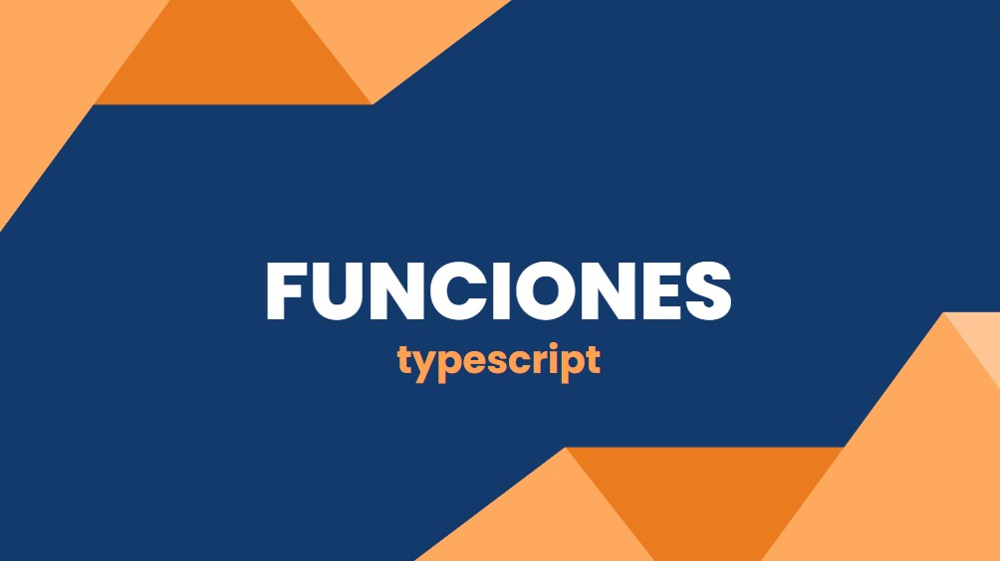

# Proyecto de Ejercicios de Funciones con TypeScript

Este proyecto contiene tres ejercicios prácticos para entender y practicar el uso de funciones en **TypeScript**.

## Requisitos previos

Antes de comenzar, asegúrate de tener instalado lo siguiente:

- **Node.js** (incluye npm): [Descargar Node.js](https://nodejs.org/)
- **Visual Studio Code**: [Descargar VSCode](https://code.visualstudio.com/)

## Instalación de TypeScript en Visual Studio Code

Sigue los siguientes pasos para instalar y configurar TypeScript en Visual Studio Code:

1. **Instalar Node.js**  
   Si no lo has hecho aún, instala Node.js desde el enlace proporcionado arriba. Esto también instalará npm, que usaremos para instalar TypeScript.

2. **Instalar TypeScript globalmente**  
   Abre una terminal en Visual Studio Code (o la terminal de tu sistema) y ejecuta el siguiente comando:
   ```bash
   npm install -g typescript
   ```
    Esto instalará TypeScript de manera global en tu sistema. Puedes verificar la instalación ejecutando:
    ```bash
    tsc -v
    ```
3. **Configurar un proyecto de TypeScript**
   En la carpeta raíz de tu proyecto, ejecuta:
   ```bash
   tsc --init
   ```

## Compilar archivos Typescript

Para compilar tus archivos .ts debes escribir el siguiente formato:
```bash
tsc <nombre_archivo>.ts
```
Esto generará un archivo con el mismo nombre en formato .js

Una vez tienes el archivo .js, solo queda compilarlo con node para poder ver el resultado en la terminal
```bash
node <nombre_archivo>.js
```

## Ejercicios para practicar funciones con Typescript

  Ejercicio 1: Calculadora Básica
  Descripción:
  Crea una función llamada calculadora que tome tres parámetros: dos números y un operador (como string). La función debe devolver el resultado de la operación entre los dos números. Los operadores permitidos son: '+', '-', '*', '/'. 

  Ejercicio 2: Concatenación de Cadenas con Parámetros Opcionales
  Descripción:
  Escribe una función llamada concatenar que tome dos cadenas de texto como parámetros. El segundo parámetro debe ser opcional y, si no se proporciona, debe usar una cadena vacía por defecto. La función debe devolver la concatenación de ambas cadenas.

  Ejercicio 3: Sobrecarga de Funciones para Combinación de Datos
  Descripción:
  Implementa una función llamada combinar que pueda aceptar tanto dos números como dos cadenas. Si se pasan números, la función debe devolver su suma. Si se pasan cadenas, debe devolver su concatenación.

## Accede a la píldora sobre funciones en Typescript

Si deseas profundizar más en el tema de funciones en TypeScript, accede a la siguiente píldora educativa: [Pildora: Funciones en typescript](https://www.canva.com/design/DAGQ7KiQc2s/rdJfc7YTuHPqDb7ap-2R5g/edit?utm_content=DAGQ7KiQc2s&utm_campaign=designshare&utm_medium=link2&utm_source=sharebutton)


